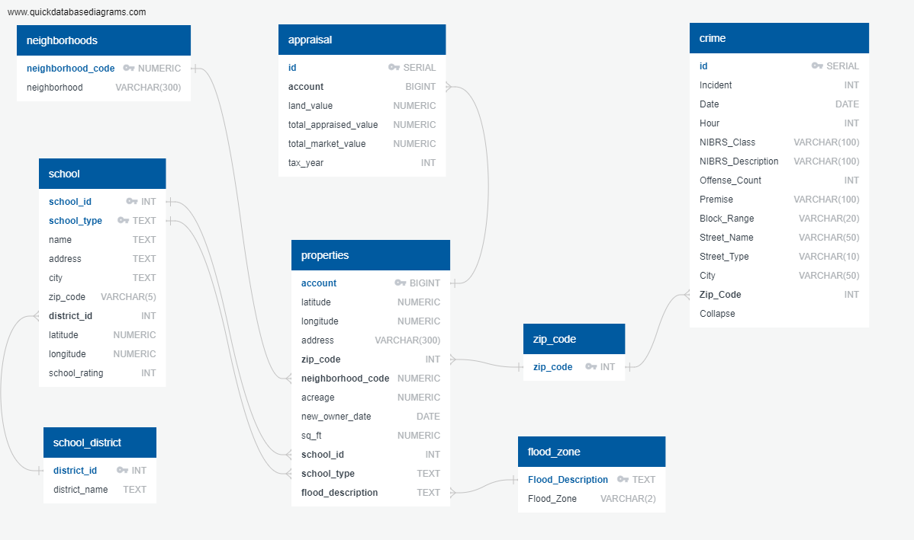

# Project Description
To do the ETL (Extract, Transform and Load) of the data needed to run an application for Houston Real Estate Investment Dashboard.

# Data Sources

## School Ratings: 
  *	Source: https://texasschoolguide.org/school-rankings/ 
  *	Download: CSV file
  
## National Flood Data: 
  *	Source: http://nationalflooddata.com/flood/floodapi/ 
  *	Web request API using street addresses from HCAD dataset
  
## Harris County Appraisal District (HCAD): 
  *	Source: https://pdata.hcad.org/download/2019
  *	Download: ZIP folders comprised of text files and csv files
  
## Crime:
  *	Source: https://www.houstontx.gov/police/cs/Monthly_Crime_Data_by_Street_and_Police_Beat.htm
  *	Download: CSV file

Files location: https://drive.google.com/drive/folders/15sKnJGCKU_VsG290i97kzsAnyc1tFNNT 

# Entity-Relation Diagram 

## Running the code
1.	Extract and Transform HCAD Data: ETL_HCAD.IPYNB
2.	Extract and Transform Load Flood and Crime Data: ETl_flood_and_crime_data.IPYNB
3.	Extract and Transform School Data: 
      a.	school_data_transformation.IPYNB
      b.	school_zone_transformation.IPYNB
4.	Load Real Estate Database:  ETL_Project_Load.IPYNB
